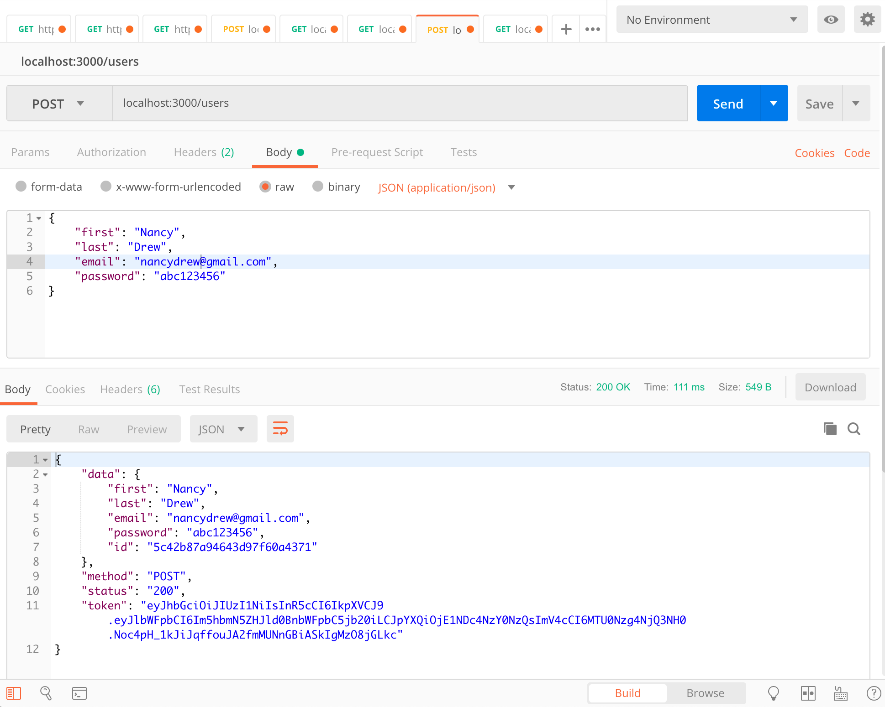
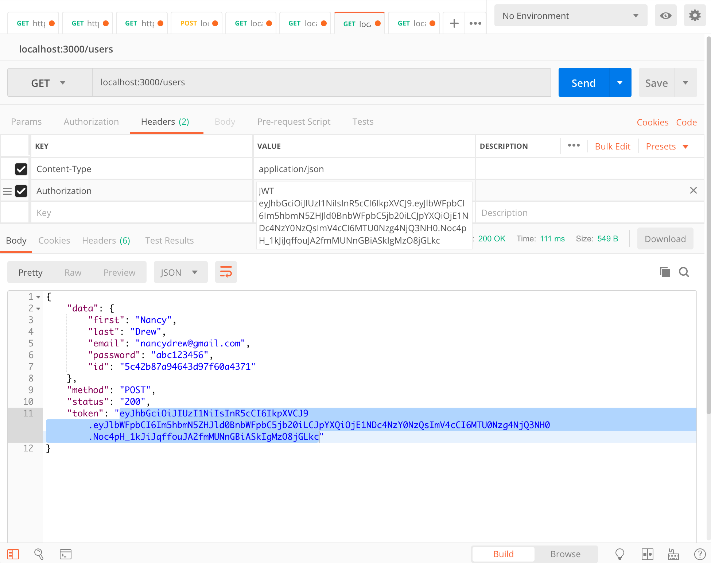
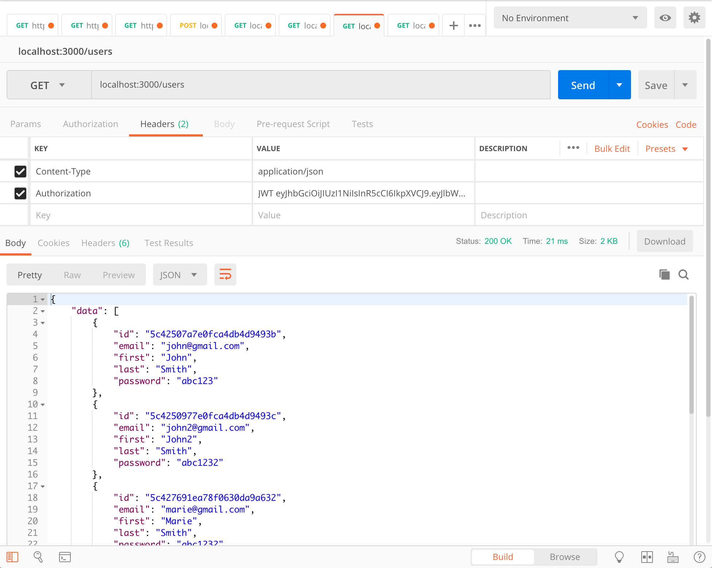

# SOEN341 Program Planner App - CourseBin
## Example server API using TypeORM + MongoDB, Express, TypeScript + Node

1. Clone repository and switch to this branch
2. Run `npm i` to install all dependencies
3. Start up a Mongodb server locally and create a database named the same as in the `ormconfig.json`, e.g. `datastore` (see [Configuring `ormconfig.json`](#Configuring-ormconfig.json) below)
4. Run `npm start` to start server ()
5. Use postman to send http requests to test API (see [Test API using postman](#Test-API-using-postman))

## Configuring `ormconfig.json`

```json
{ 
  "type": "mongodb", // Keep this if running mongodb locally
  "host": "localhost", // Keep this if running mongodb locally
  "port": 27017, // Change this if different
  "username": "root", // Can likely keep the same (default)
  "password": null, // Can likely keep the same (default)
  "database": "datastore", // Change this if different
  ...
}
```

## Test API using postman
In Postman, with the app started up (`npm start`), direct an http `POST` request to the url `localhost:3000/users` and fill the `Body` with a `JSON` object with the fields `first`, `last`, `email`, and `password` and hit `Send`. The response body should return a `JSON` object with a `token` field. Copy this field.


With the `token` value copied, go to the `Headers` tab in Postman and paste that value in a field with key `Authorization` and value `JWT <copied-token>` (make sure to have that space between the `JWT` and `<copied-token>`). Also make sure that there's another header field called `Content-Type` with value `application/json`. 


Now change the method from `POST` to `GET` and hit `Send`. Your response body should return a list of user objects indicating that the request was successful and you were properly authorized using the provided JWT token in the header!
